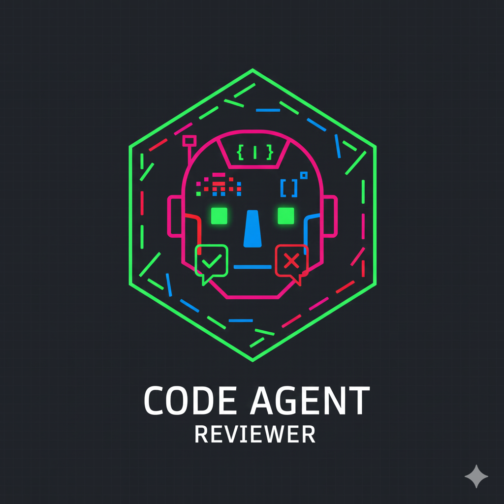

# Pull Request Review Geany

<p align="center">
  
</p>

An intelligent GitHub App that automatically reviews pull requests using AI agents. The system employs multiple specialized agents working in parallel to analyze different aspects of code changes, providing comprehensive security and code quality reviews.

## 🌟 Features

- **Multi-Agent Review System**: Parallel execution of specialized review agents
- **Security Analysis**: Automated vulnerability detection and security best practices validation
- **Code Quality Review**: Style, tidiness, and best practices analysis
- **GitHub App Integration**: Seamless integration with GitHub Pull Requests
- **Clean Architecture**: Well-structured, maintainable, and extensible codebase
- **Configurable LLM Backend**: Support for different AI models via configuration

## 🏗️ System Architecture

### Clean Architecture

The project follows Clean Architecture principles with clear separation of concerns:

```
pull-request-review-geany/
├── agents/          # AI agent implementations (Domain Layer)
│   ├── agent.py     # Base agent abstract class
│   ├── factory.py   # Agent factory pattern implementation
│   └── gemini.py    # Gemini AI agent implementations
├── api/             # API endpoints (Interface Layer)
│   └── github.py    # GitHub webhook handlers
├── services/        # Business logic (Application Layer)
│   ├── github.py    # GitHub event handling
│   └── reviewer.py  # Review orchestration workers
├── schemas/         # Data models (Domain Layer)
│   ├── github.py    # GitHub-specific schemas
│   └── reviewer.py  # Review message schemas
├── utils/           # Utilities (Infrastructure Layer)
│   ├── github.py    # GitHub API utilities
│   └── jwt.py       # JWT authentication utilities
└── views/           # UI templates
```

### How It Works

1. **Webhook Reception**: GitHub sends webhook events when PRs are opened or updated
2. **Event Processing**: The system validates the webhook signature and processes PR events
3. **Parallel Review**: Multiple specialized agents work concurrently on different aspects:
   - **Security Reviewer Agent**: Analyzes code for security vulnerabilities
   - **Tidyness Reviewer Agent**: Reviews code style and best practices
4. **Queue-Based Architecture**: Each agent has its own async queue for task processing
5. **AI-Powered Analysis**: Agents use LLM (Gemini) to analyze git diffs
6. **Automated Comments**: Review results are posted as PR comments on GitHub

### Agent System

The multi-agent architecture allows for:
- **Specialization**: Each agent focuses on specific review aspects
- **Parallel Execution**: Reviews happen concurrently for faster feedback
- **Extensibility**: New agents can be added easily via the factory pattern
- **Flexibility**: Different LLM models can be configured per repository

## 🚀 Quick Start

### Using Docker (Recommended)

Pull and run the pre-built Docker image:

```bash
docker pull ghcr.io/piyushxcoder/pull-request-review-geany:latest

docker run -d \
  -p 8000:8000 \
  --env-file .env \
  -v $(pwd)/pull-request-review-geany.2025-11-28.private-key.pem:/app/pull-request-review-geany.2025-11-28.private-key.pem \
  ghcr.io/piyushxcoder/pull-request-review-geany:latest
```

### Build from Source

#### Prerequisites

- Python 3.13+
- pip
- Git

#### Installation Steps

1. **Clone the repository**:
   ```bash
   git clone https://github.com/PiyushXCoder/pull-request-review-geany.git
   cd pull-request-review-geany
   ```

2. **Create virtual environment**:
   ```bash
   python -m venv .venv
   source .venv/bin/activate  # On Windows: .venv\Scripts\activate
   ```

3. **Install dependencies**:
   ```bash
   pip install -r requirements.txt
   ```

4. **Configure environment variables** (see Configuration section below)

5. **Run the application**:
   ```bash
   uvicorn main:app --host 0.0.0.0 --port 8000
   ```

## ⚙️ Configuration

### Environment Variables (.env)

Create a `.env` file in the project root with the following variables:

```env
# GitHub App Configuration
WEBHOOK_SECRET=your_github_webhook_secret_here
APP_ID=your_github_app_id_here
PRIVATE_KEY_FILE=pull-request-review-geany.2025-11-28.private-key.pem

# AI Model Configuration
GEMINI_API_KEY=your_gemini_api_key_here
```

#### Required Variables:

- **WEBHOOK_SECRET**: Secret key for validating GitHub webhook signatures
  - Generate in GitHub App settings
  - Used to verify incoming webhook requests are legitimate

- **APP_ID**: Your GitHub App ID
  - Found in GitHub App settings
  - Used for authentication

- **PRIVATE_KEY_FILE**: Path to your GitHub App private key file
  - Downloaded when creating the GitHub App
  - Used for JWT token generation

- **GEMINI_API_KEY**: Google Gemini API key
  - Get from [Google AI Studio](https://makersuite.google.com/app/apikey)
  - Required for AI-powered code reviews

### Reviewer Configuration (reviewer-config.json)

The system supports per-repository configuration through a `.github/reviewer-config.json` file in your repository:

```json
{
  "llm_model": "gemini-2.5-flash"
}
```

#### How It Works:

1. **Automatic Detection**: When a PR is created, the system checks for `.github/reviewer-config.json` in the repository
2. **Model Selection**: If the config file exists, it reads the `llm_model` preference
3. **Agent Switching**: The factory creates the appropriate agent based on the configured model
4. **Fallback**: If no config is found, defaults to `gemini-2.5-flash`

#### Benefits:

- **Flexibility**: Different repositories can use different AI models
- **Cost Control**: Switch to lighter models for less critical projects
- **Quality Tuning**: Use advanced models for critical codebases
- **Easy Migration**: Change AI providers without code changes

#### Supported Models:

Currently supported:
- `gemini-2.5-flash` (default)

To add support for new models, extend the `AgentFactory` in `agents/factory.py` and implement corresponding agent classes.

## 🐳 Docker Setup

### Building the Docker Image

```bash
docker build -t pull-request-review-geany .
```

### Running with Docker Compose

Create a `docker-compose.yml`:

```yaml
version: '3.8'

services:
  app:
    image: ghcr.io/piyushxcoder/pull-request-review-geany:latest
    ports:
      - "8000:8000"
    env_file:
      - .env
    volumes:
      - ./pull-request-review-geany.2025-11-28.private-key.pem:/app/pull-request-review-geany.2025-11-28.private-key.pem
    restart: unless-stopped
```

Run with:

```bash
docker-compose up -d
```

## 📝 Setting Up GitHub App

1. **Create a GitHub App**:
   - Go to GitHub Settings → Developer settings → GitHub Apps
   - Click "New GitHub App"

2. **Configure the App**:
   - Name: "Pull Request Review Geany"
   - Homepage URL: Your server URL
   - Webhook URL: `https://your-domain.com/webhook`
   - Webhook Secret: Generate a random secret
   - Permissions:
     - Pull requests: Read & Write
     - Contents: Read
     - Issues: Read & Write (for comments)
   - Events:
     - Pull request (opened, synchronize)

3. **Generate Private Key**:
   - In your GitHub App settings, scroll to "Private keys"
   - Click "Generate a private key"
   - Save the downloaded `.pem` file to your project directory

4. **Install the App**:
   - Install the GitHub App on your repositories
   - Note the Installation ID from the URL

## 🔍 API Endpoints

- `GET /` - Health check and landing page
- `POST /webhook` - GitHub webhook endpoint
- `GET /callback` - OAuth callback endpoint
- `GET /logo.png` - Logo asset

## 🧪 Testing

Run the application locally and use tools like [smee.io](https://smee.io) to forward GitHub webhooks to your local instance for testing:

```bash
# Install smee client
npm install --global smee-client

# Forward webhooks
smee --url https://smee.io/your-unique-url --target http://localhost:8000/webhook
```

## 📊 Technology Stack

- **Framework**: FastAPI (async web framework)
- **AI/ML**: LangChain + Google Gemini
- **GitHub Integration**: PyJWT, httpx
- **Server**: Uvicorn (ASGI server)
- **Python**: 3.13+

## 🤝 Contributing

Contributions are welcome! Please feel free to submit a Pull Request. The review agents will analyze your code automatically! 😉

## 📄 License

This project is licensed under the MIT License - see the [LICENSE](LICENSE) file for details.

## 👤 Author

**PiyushXCoder**
- GitHub: [@PiyushXCoder](https://github.com/PiyushXCoder)
- Email: piyushxcoder@gmail.com

## 🙏 Acknowledgments

- Google Gemini for AI capabilities
- FastAPI for the excellent web framework
- LangChain for AI orchestration utilities

---

<p align="center">Made with ❤️ by <a href="https://github.com/PiyushXCoder">PiyushXCoder</a></p>
